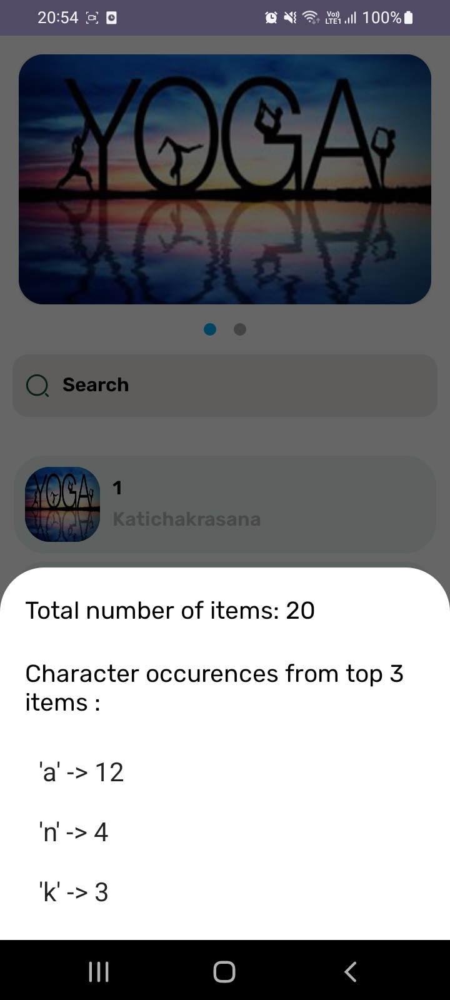

# My Android Project

## Built using MVVM clean architecture in Jetpack compose

This is a sample Android project that demonstrates the use of fetching data from local raw file and displaying on the app.

## Features

- Hilt
- Search
- Get most characters occurences

## Screenshots

## Installation

1. Clone the repository:
   
   git clone https://github.com/MoazamHussain/BlueApp.git
